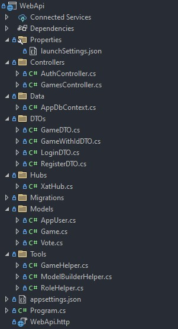
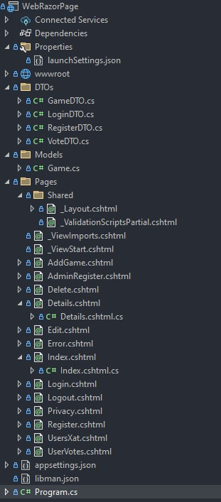
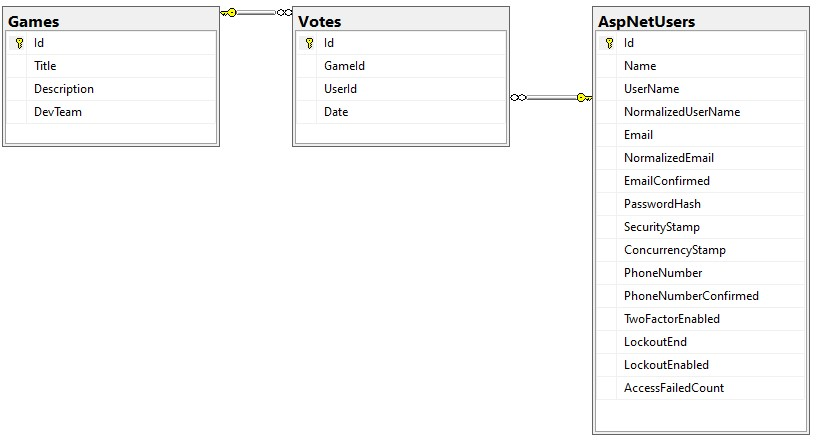

# m09-t1-pr2-apirest-ArnauPascual7

### Arnau Pascual

### Usuaris per defecte

User:
- Email: user@example.com
- Contrasenya: P@ssw0rd123

Admin:
- Email: admin@example.com
- Contrasenya: P@ssw0rd123

## Solució Proposada

### WebApi

Aquest projecte conté l'api.

- **Paquets Instal·lats**:
    - Microsoft.AspNetCore.Authentication
    - Microsoft.AspNetCore.Authentication.JwtBearer
    - Microsoft.AspNetCore.Identity.EntityFrameworkCore
    - Microsoft.AspNetCore.OpenApi
    - Microsoft.EntityFrameworkCore
    - Microsoft.EntityFrameworkCore.Design
    - Microsoft.EntityFrameworkCore.SqlServer
    - Microsoft.EntityFrameworkCore.Tools
    - Microsoft.Extensions.Identity.Core
    - Microsoft.VisualStudio.Web.CodeGeneration.Design
    - Swashbuckle.AspNetCore.Swagger
    - Swashbuckle.AspNetCore.SwaggerGen
    - Swashbuckle.AspNetCore.SwaggerUI
- **Controladors**:
    - AuthController: Aquest controlador és per a l'autenticacó dels usuaris, conté el registre i el login per a usuaris i el registre i login per a usuaris administradors.
    - GamesController: Aquest controlador té tot lo relacionat amb els jocs, obtenir tota la llista de jocs, obtenir un joc a partir del seu id, actualitzar un joc, afegir un joc, eliminar un joc, votar un joc, i obtenir la llista de vots. No tots els usuaris tene accés a fer totes les accions, algunes com votar només están accesibles per a usuaris registrats, mentre que obtenir tots els jocs està per a tothom, i també hi ha restriccions per als usuaris, ja que no poden crear, editar o eliminar jocs, ja que això només està disponible per a usuaris administradors.
- **DbContext**:
    - AppDbContext: EL DbContext inicialitza les taules de la base de dades, i amb l'ajuda d'una helper class també afegeix 5 jocs a la taula Games. El DbContext també crea les relacions esntre les taules de Games, Users i Votes.
- **DTOs**:
    - GameDTO: Aquest DTO és per a utilitzar-lo quan no necessitem el id del joc i necessitem els vots que té el joc.
    - GameWithIdDTO: Aquest DTO és igual que l'anterior, però aquest conté l'id del joc, ja que a vegades és necessari per a realitzar diverses taques.
    - LoginDTO: Aquest DTO només conté la informació necessaria d'un usuari per a fer login, email i contrasenya, LoginDTO s'utilitza tant per a Usuaris com per a Administradors.
    - RegsiterDTO: Aquest DTO conté tota la informació necessaria per a que un usuari es pugui donar d'alta, RegisterDTO s'utilitza tant per a Usuaris com per a Administradors.
- **Hubs**:
    - XatHub: Aquest Hub conté les funcions per a utilitzar el Xat des del client, la més important SendMessage, que envia el missatge.
- **Models**:
    - AppUser: Aquest model hereta de Identity User, a més de afegir les propietats de Name i Votes, Votes correspon a la llista de vots que ha fet l'usuari.
    - Game: Aquest model és el base dels jocs, i al igual que Appuser també els vots que té a Votes.
    - vote: Aquest model representa la taula que es crea entre Appuser i Game, i conté els vots amb l'usuari que ha votat, i el joc al que ha votat, a més de la data en que s'ha votat.
- **Tools**:
    - GameHelper: Aquesta Helper Class s'utilitza per a transformar la infromació continguda en el model Game a un GameDTO i al revés.
    - ModelBuilderHelper: Aquesta Helper Class conté els mètodes Seed per a inicialitzar la base de dades amb informació, un per als jocs que es crida des del DbContext i una altra per a inicialitzar els usuaris que es crida des del Program.cs
    - RoleHelper: Aquesta Helper Class conté el mètode per a incialitzar els rols dels usuaris; també es crida des del Program.cs
- **appsettings.json**: Aquest arxiu conté la connexió amb la base de dades, i la JwtSettings per al Token.
- **Program.cs**: El program conté inicialitzacions i configuracions de serveis, així com la configuració del Swagger, el Token, la contrasenya, el xat, l'autenticació, i demés. també inicialitza els rols i les usuaris de User i Admin.

### WebRazorPage

Aquest projecte conté el client.

- **[SignalR](./SystemSolution/WebRazorPage/wwwroot/js/signalR/microsoft/signalr/dist/browser)**: Per al xat.
- **DTOs**:
Tots els DTOs del client són iguals al seus respectius de l'api.
    - GameDTO: Aquest DTO al igual que el respectiu de l'api no conté l'id.
    - LoginDTO: Aquest DTO és per a la pàgina de Login, per a poder iniciar sessió.
    - RegsiterDTO: Aquest DTO és per a la pàgina de resitre, conté totes les propietats per a registrar un usuari.
    - VoteDTO: Aquest DTO no està present en la api, en el client s'utilitza per a obtenir els vots sense el id.
- **Models**:
    - Game: Aquest és l'únic model que utilitza el client, en algunes tasques és necesari el id del joc, aquest model no és igual que el de l'api, ja que aquest és igual a GameWithIdDTO de l'api.
- **Pages**:
    - _Layout: Conté la capçalera i el peu de pàgina de totes les pàgines. La capçalera conté els enllaços a les demés pàgines i el peu de pàgina informació. La capçalera és diferents segons no tinguis sessió iniciada, siguis un usuari o un administrador.
    - AddGame: Aquesta pàgina només és utilitzable per a administradors, permet crear un joc a través d'un formulari.
    - AdminRegsitre: Aquesta pàgina només és utilitzable per a administradors, permet crear un usuari administrador.
    - Delete: Aquesta pàgina només és utilitzable per a administradors, permet eliminar un joc.
    - Details: Aquesta pàgina conté informació detallada sobre un joc, també si ets un usuari logegat pots votar el joc.
    - Edit: Aquesta pàgina només és utilitzable per a administradors, permet editar la informació d'un joc.
    - Index: Aquesta pàgina conté tota la llista de jocs de la base de dades. Si ets un administrador també tens accés a editar, eliminar i crear jocs.
    - Login: Aquesta pàgina és per iniciar sessió.
    - Logout: Aquesta pàgina no és una pàgina real, només serveix per a tancar la sessió, no té una pàgina de veritat.
    - Register: Aquesta pàgina és per a registrar usuaris normals.
    - UsersXat: Aquesta pàgina conté el xat, des del qual els usuaris poden xatejar.
    - UserVotes: Aquesta pàgina conté una llista dels vots que ha realitzat l'usuari.
- **appsettings.json**: Aquest a més del que ja ve per defecte conté el mateix que l'api de JwtSettings.
- **Program.cs**: El program conté inicialitzacions i configuracions de serveis.

## Diagrama BBDD final

La taula Votes es crea de la relació de molts-molts entre jocs i usuaris.

## Bibliografía

> eduard-ruesga-xtec. (Sense Data). M09-T1.APIrest. GitHub. Recuperat el 1/4/2025 de https://github.com/eduard-ruesga-xtec/M09-T1.APIrest.

> ArnauPascual7. (Sense Data). FilmCatalog. GitHub. Recuperat el 1/4/2025 de https://github.com/ArnauPascual7/FilmCatalog.

> Sense Autor. (Sense Data). Access HttpContext in ASP.NET Core. Microsoft. Recuperat el 20/4/2025 de https://learn.microsoft.com/en-us/aspnet/core/fundamentals/http-context?view=aspnetcore-7.0&WT.mc_id=DT-MVP-4015686#access-httpcontext-from-a-razor-view-in-mvc.

> doggy8088. (15/3/2023). Unable to get HttpContext.Session from View in MVC or Razor Page. GitHub. Recuperat el 20/4/2025 de https://github.com/dotnet/AspNetCore.Docs/issues/29273.

> LeSteelBox. (16/6/2022). Get current (logged in) user in ASP.NET Core 6.0 Razor Pages. StackOverflow. Recuperat el 20/4/2025 de https://stackoverflow.com/questions/72649878/get-current-logged-in-user-in-asp-net-core-6-0-razor-pages.

> Lucho Gizdov. (19/12/2020). Get current (logged) user in ASP.NET Core 3.0 .razor page. StackOverflow. Recuperat el 20/4/2025 de https://stackoverflow.com/questions/56970377/get-current-logged-user-in-asp-net-core-3-0-razor-page/56970575.

> Eduard. (Sense Data). T1. Generació de serveis en xarxa. Documents de Google. Recuperat el 1/4/2025 de https://docs.google.com/document/d/1kAl8YOME8d3nd1EDz-KWBzpKJbxkLfBBoFTOlOj5P2k/edit?tab=t.69iwpexcf2lt.

> ArnauPascual7. (Sense Data). t5-pr1-ArnauPascual7. GitHub. Recuperat el 20/4/2025 de https://github.com/ArnauPascual7/t5-pr1-ArnauPascual7.

> ArnauPascual7. (Sense Data). t4-pr1-ArnauPascual7. GitHub. Recuperat el 20/4/2025 de https://github.com/ArnauPascual7/t4-pr1-ArnauPascual7.
